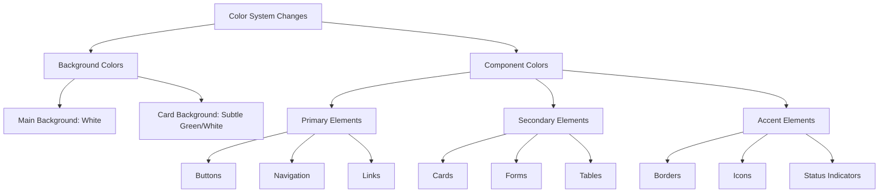

# UI Color Scheme Redesign Plan

## Overview

Implement a white background with green-themed components for a clean, professional look.

## Color System Changes



## Implementation Steps

1. **Base Theme Adjustments**
    - Reset background to white
    - Keep component-specific green theming
    - Maintain text contrast ratios

2. **CSS Variables Update**
   ```css
   :root {
     --background: 0 0% 100%;        /* Pure white */
     --foreground: 140 20% 20%;      /* Dark text */
     --primary: 145 60% 45%;         /* Green primary */
     --secondary: 155 20% 80%;       /* Light green secondary */
   }
   ```

3. **Component-Specific Changes**
    - Buttons: Green primary colors
    - Cards: Subtle green accents
    - Forms: Green focus states
    - Navigation: Green active states
    - Status indicators: Green success states

4. **Verification Points**
    - White background across all pages
    - Consistent green component styling
    - Proper contrast with white background
    - Accessibility compliance